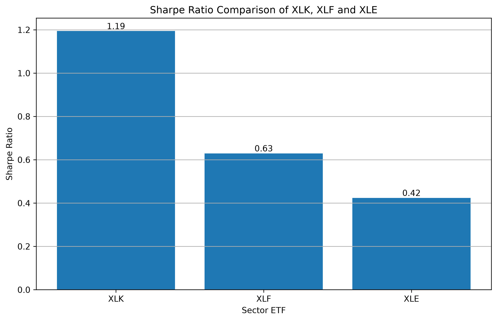
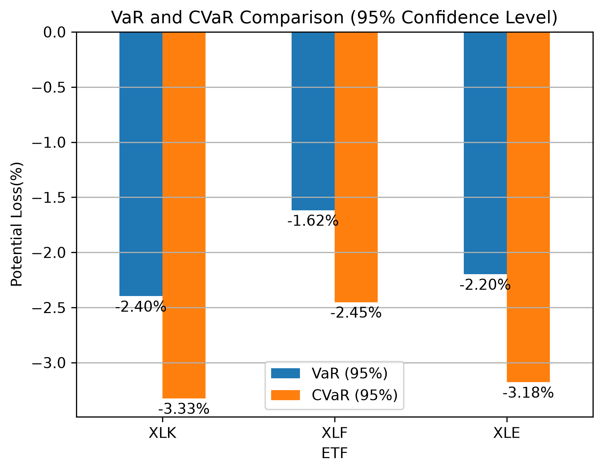
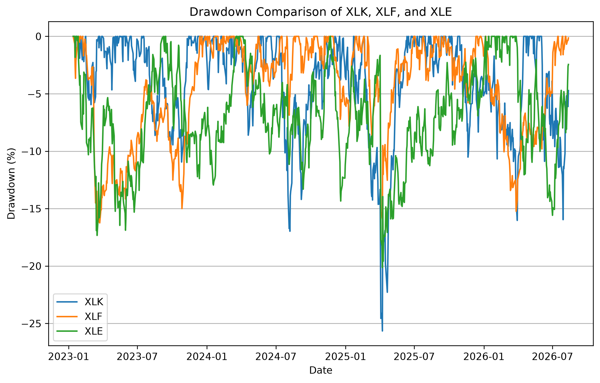

# Cross-Sector ETF Risk Analysis Report

## Executive Summary

This project evaluates the risk-return characteristics of three sector ETFs:

- **XLK (Technology Sector)**
- **XLF (Financial Sector)**
- **XLE (Energy Sector)**

The objective is to compare sector-level return performance, volatility drivers, and risk characteristics using historical market data.

The analysis combines:

- Return performance analysis
- Sector-specific volatility interpretation
- Risk-adjusted performance measurement
- Downside risk evaluation

Four key risk metrics are applied:

- Sharpe Ratio
- Value at Risk (VaR)
- Conditional Value at Risk (CVaR)
- Maximum Drawdown (MDD)

### Key Findings

- **XLK generated the strongest return and risk-adjusted performance**, achieving the highest Sharpe Ratio. However, its higher valuation sensitivity and growth dependence resulted in greater downside exposure.

- **XLF demonstrated the most stable risk profile**, with lower volatility, smaller VaR/CVaR losses, and the smallest Maximum Drawdown among the three ETFs.

- **XLE showed higher cyclical risk**, driven by commodity price movements, supply-demand conditions, and geopolitical uncertainty.

Overall, the analysis highlights that sector allocation involves a trade-off between growth potential, risk exposure, and downside protection.

---

## 1. Return Performance Analysis

### 1.1 Overview

This section evaluates the historical return performance of three sector ETFs:

- **XLK (Technology Sector)**
- **XLF (Financial Sector)**
- **XLE (Energy Sector)**

The analysis focuses on cumulative investment growth and daily return characteristics based on historical price data.

A hypothetical initial investment of **$1,000** is used to compare the wealth accumulation performance of each ETF over the sample period.

---

## 1.2 Investment Growth Analysis

*Figure 1. Growth of a hypothetical $1,000 investment across XLK, XLF, and XLE.*

The cumulative return comparison illustrates the growth of a hypothetical $1,000 investment across the three sector ETFs.

XLK achieved the strongest investment growth during the sample period, increasing from approximately **$1,000 to around $3,000**. XLF and XLE also generated positive returns, reaching approximately **$1,600** and **$1,500**, respectively.

Overall, the chart demonstrates significant differences in long-term wealth accumulation among different sectors. Technology stocks generated stronger capital appreciation, while financial and energy sectors delivered more moderate but positive growth.

---

## 1.3 Investment Performance Summary

The following table summarizes the investment outcomes and volatility characteristics of the three ETFs.

| ETF | Initial Investment | Final Value | Total Return | Annual Volatility |
| --- | --- | --- | --- | --- |
| XLK | $1,000 | $3,000 | +200% | 24.26% |
| XLF | $1,000 | $1,600 | +60% | 16.36% |
| XLE | $1,000 | $1,500 | +50% | 22.27% |

XLK generated the highest cumulative return among the three ETFs, reflecting strong long-term growth performance from the technology sector.

However, higher return was accompanied by higher volatility. Annualized volatility indicates differences in return fluctuations, with XLK and XLE experiencing larger price movements compared with XLF.

---

## 1.4 Daily Return Distribution Analysis

### 1.4.1 XLK Daily Return Distribution

*Figure 2. Daily return distribution of XLK.*

XLK displayed a relatively wide daily return distribution, indicating greater variation in daily performance.

This reflects the characteristics of technology companies, where valuations are often influenced by future growth expectations, interest rate assumptions, and investor risk appetite.

---

### 1.4.2 XLF Daily Return Distribution

*Figure 3. Daily return distribution of XLF.*

XLF showed a more concentrated return distribution, suggesting relatively stable daily return behavior during the sample period.

Compared with technology and energy sectors, financial companies generally exhibit lower valuation sensitivity to long-term growth expectations, resulting in relatively moderate price fluctuations.

---

### 1.4.3 XLE Daily Return Distribution

*Figure 4. Daily return distribution of XLE.*

XLE exhibited a wider distribution of daily returns, reflecting larger fluctuations compared with more stable sectors.

The higher volatility is mainly associated with energy companies' exposure to commodity price movements, supply-demand changes, and geopolitical uncertainty.

---

# 2. Sector Volatility Drivers Analysis

## 2.1 Overview

The cumulative return comparison and daily return distribution analysis demonstrate significant differences in performance and volatility characteristics among XLK, XLF, and XLE.

Although all three sector ETFs generated positive returns during the sample period, their return patterns were influenced by different economic exposures and market drivers.

This section analyzes the fundamental factors behind each sector's volatility by examining:

- Sector business exposure
- Key market drivers
- Volatility transmission mechanisms
- Relationship with observed return performance

---

## 2.2 XLK - Technology Sector

## Main Exposure

XLK primarily provides exposure to technology-related industries, including:

- Semiconductor companies
- Software companies
- Hardware manufacturers
- Technology service providers

Technology companies are generally characterized by strong growth potential and higher valuation multiples compared with traditional sectors.

---

## Sector Background

Compared with traditional industries, technology companies' **valuation** relies more heavily on **future earnings growth expectations**.

Since a significant portion of technology companies' value comes from expected future cash flows, their stock prices are more sensitive to changes in:

- Interest rate expectations
- Long-term growth assumptions
- Investor risk appetite

Therefore, technology stocks usually demonstrate higher valuation sensitivity and greater volatility.

---

## Volatility Transmission Mechanisms

### 1. Interest Rate Transmission

Technology companies are often valued based on their expected future cash flows. Therefore, changes in interest rate expectations can significantly influence their valuation multiples.

When interest rate expectations rise, investors apply a higher discount rate to future earnings, reducing the present value of expected cash flows.

As a result, high-growth technology companies may experience larger valuation adjustments compared with companies with more stable current earnings.

---

### 2. Growth Expectation Transmission

The valuation of major technology companies is highly dependent on investors' expectations regarding future business growth.

Important earnings assumptions include:

- Revenue growth forecast
- Margin expansion expectation
- EPS forecast
- Free Cash Flow (FCF) expectation

Because technology companies usually trade at higher valuation multiples, changes in growth expectations can lead to significant price movements.

For example, a company experiencing slower-than-expected revenue growth may face a sharp valuation adjustment even if current earnings remain strong.

---

### 3. Market Sentiment Transmission: Risk-on and Risk-off Environment

During a **risk-on environment**, investors tend to have higher confidence in future economic growth and are more willing to allocate capital toward higher-growth assets.

As market uncertainty decreases, investors are more likely to accept higher valuation multiples for technology companies due to stronger expectations for future revenue growth, margin expansion, and innovation-driven earnings potential.

This increased demand for technology stocks can lead to valuation expansion and stronger performance for XLK.

In contrast, during a **risk-off environment**, investors usually reduce exposure to high-valuation and growth-oriented assets due to concerns about economic slowdown, higher interest rates, or uncertainty in future earnings.

Since technology companies are often priced based on long-term growth expectations, negative changes in market sentiment can result in faster valuation repricing compared with more defensive sectors.

Therefore, technology sectors tend to experience stronger upside momentum during favorable market conditions but larger corrections during periods of uncertainty.

---

## 2.3 XLF - Financial Sector

## Main Exposure

XLF primarily provides exposure to financial institutions, including:

- Commercial banks
- Insurance companies
- Capital market companies
- Financial service providers

Compared with technology companies, financial companies generate earnings mainly through lending activities, capital allocation, and financial services.

Therefore, their performance is closely connected with:

- Interest rate conditions
- Credit cycles
- Economic activity
- Capital market conditions

---

## Sector Background

Unlike technology companies, whose valuations are mainly driven by future growth expectations, financial companies are more dependent on current economic conditions and operating environments.

The profitability of financial institutions is highly influenced by:

- Interest rate environment
- Net Interest Margin (NIM)
- Credit quality
- Loan demand
- Economic growth expectations

Therefore, XLF generally exhibits a more cyclical return pattern and is sensitive to changes in macroeconomic conditions rather than long-term growth expectations.

---

## Volatility Transmission Mechanisms

### 1. Interest Rate Transmission

Interest rates are one of the most important factors affecting financial sector performance because they directly influence banks' lending profitability.

A moderate increase in interest rates can benefit banks by increasing lending yields and expanding **Net Interest Margin (NIM)**, which improves profitability expectations.

However, if interest rates remain high for an extended period, borrowing costs may increase, loan demand may weaken, and credit risks may rise.

Therefore, the impact of interest rates on XLF depends on the broader economic environment rather than simply the direction of rate movements.

---

### 2. Credit Cycle Transmission

Financial institutions are highly exposed to credit conditions because a significant portion of their earnings comes from lending activities.

During periods of strong economic growth, businesses and consumers generally maintain healthier financial conditions, supporting loan growth and reducing default risks.

However, when economic conditions deteriorate, rising unemployment, weaker corporate profitability, or declining consumer confidence can increase default risk.

Banks may need to increase loan loss provisions, which reduces profitability expectations and creates pressure on financial sector valuations.

---

### 3. Market Sentiment Transmission: Risk-on and Risk-off Environment

Although financial stocks are generally less sensitive to growth expectations compared with technology stocks, investor sentiment still plays an important role in determining capital flows into the financial sector.

During a **risk-on environment**, investors usually expect stronger economic activity, higher corporate investment, and improved financial conditions.

This increases expectations for:

- Loan growth
- Capital market activity
- Corporate financing demand
- Overall profitability of financial institutions

As a result, investors may increase exposure to financial stocks, supporting XLF performance.

In contrast, during a **risk-off environment**, investors become more concerned about economic slowdown, liquidity conditions, and potential financial instability.

Since banks are closely connected with the broader economy, negative sentiment can quickly translate into concerns about:

- Credit quality deterioration
- Higher default rates
- Lower profitability expectations

Therefore, financial stocks usually experience pressure during periods of economic uncertainty, although their downside movements are often less driven by valuation compression compared with technology stocks.

---

## 2.4 XLE - Energy Sector

## Main Exposure

XLE primarily provides exposure to energy-related industries, including:

- Oil and gas exploration companies
- Integrated energy companies
- Energy production and service providers

Unlike technology and financial sectors, energy companies are highly dependent on commodity markets, especially crude oil prices.

Therefore, XLE performance is strongly influenced by:

- Global energy supply
- Demand conditions
- Commodity price movements
- Geopolitical factors

---

## Sector Background

Compared with technology and financial companies, energy companies have a more cyclical business model because their profitability is closely linked to commodity price movements.

The earnings of energy companies are mainly influenced by:

- Crude oil and natural gas prices
- Global supply and demand conditions
- Production decisions from major energy producers
- Geopolitical events

Therefore, XLE usually demonstrates stronger cyclical characteristics and higher sensitivity to external market shocks.

---

## Volatility Transmission Mechanisms

### 1. Oil Price Transmission

Crude oil price is one of the most important drivers of energy sector performance because it directly affects the revenue and profitability of energy companies.

When oil prices increase, energy companies can generate higher revenue and stronger cash flow, improving investor expectations regarding future earnings.

As a result, capital tends to flow into the energy sector, supporting XLE performance.

However, when oil prices decline, investors may reassess the profitability of energy companies, leading to:

- Downward earnings revisions
- Lower cash flow expectations
- Increased selling pressure

Because energy companies have direct exposure to commodity prices, changes in oil prices can quickly translate into significant movements in XLE.

---

### 2. Supply-Demand Cycle Transmission

Energy markets are highly influenced by global supply and demand conditions.

Unlike sectors driven mainly by company-specific innovation, energy prices are determined by the balance between global production and consumption.

When global economic activity strengthens, energy demand typically increases, supporting higher commodity prices and improving energy sector profitability.

In contrast, concerns about economic slowdown can reduce energy demand expectations and pressure energy prices.

Therefore, XLE performance is closely linked to global economic cycles and commodity market conditions.

---

### 3. Geopolitical Risk Transmission

Energy markets are particularly sensitive to geopolitical events because global oil supply can be affected by:

- Political conflicts
- Production disruptions
- Export restrictions
- Decisions from major energy-producing countries

When geopolitical uncertainty increases, investors may expect potential supply disruptions, which can push oil prices higher.

This can temporarily benefit energy companies through stronger commodity prices.

However, geopolitical uncertainty can also increase market uncertainty and create larger price fluctuations, resulting in higher volatility in the energy sector.

---

### 4. Market Sentiment Transmission: Risk-on and Risk-off Environment

Compared with technology stocks, energy companies are not primarily viewed as long-term growth assets.

Instead, investor sentiment toward XLE is often connected with expectations regarding:

- Economic activity
- Inflation trends
- Commodity prices
- Global industrial demand

During a **risk-on environment**, investors usually expect stronger economic growth and higher energy demand.

This can improve expectations for commodity prices and increase capital allocation toward cyclical sectors such as energy.

During a **risk-off environment**, investors often become concerned about economic slowdown and weaker commodity demand.

This can reduce expectations for energy prices and increase downside pressure on energy stocks.

Therefore, XLE tends to perform strongly during periods of economic expansion and commodity strength but may experience significant volatility during periods of macroeconomic uncertainty.

---

# 3.  Return Performance Analysis Summary

The return analysis shows that all three sector ETFs generated positive investment growth during the sample period.

XLK achieved the strongest cumulative performance, reflecting the strong long-term growth potential of the technology sector. However, this higher return was accompanied by greater volatility due to sensitivity to interest rates, growth expectations, and investor sentiment.

XLF demonstrated a more stable return profile, reflecting the characteristics of financial companies whose performance depends primarily on interest rate conditions, credit cycles, and economic activity.

XLE generated positive but more volatile returns due to its direct exposure to commodity prices, supply-demand cycles, and geopolitical risks.

Overall, the analysis highlights that different sectors respond differently to macroeconomic environments:

- **Technology sectors are more sensitive to valuation expectations and market risk appetite.**
- **Financial sectors are more influenced by interest rates and economic cycles.**
- **Energy sectors are more exposed to commodity markets and geopolitical uncertainty.**

These differences provide the foundation for further risk analysis using:

- Sharpe Ratio
- Value at Risk (VaR)
- Conditional Value at Risk (CVaR)
- Maximum Drawdown

# 4. Risk Metrics Methodology

### Overview of Risk Measurement

Investment performance cannot be evaluated only by historical returns. Although higher returns may appear attractive, they may also result from taking higher levels of risk.

According to Investopedia, investors should consider multiple risk measurements to understand the relationship between return and risk. Metrics such as volatility measures and risk-adjusted performance indicators help evaluate whether an investment's return was achieved efficiently or simply resulted from accepting greater uncertainty. :contentReference[oaicite:2]{index=2}

Different risk metrics capture different dimensions of investment risk:

- Volatility-based metrics measure the overall fluctuation of returns;
- Risk-adjusted metrics evaluate whether returns adequately compensate for the risk taken;
- Downside risk metrics focus on potential losses during unfavorable market conditions.

In this project, four risk metrics are selected to provide a comprehensive comparison of XLK, XLF, and XLE:

- Sharpe Ratio: evaluates risk-adjusted return efficiency;
- Value at Risk (VaR): measures potential loss under normal market conditions;
- Conditional Value at Risk (CVaR): evaluates the severity of losses beyond the VaR threshold;
- Maximum Drawdown (MDD): measures the largest historical peak-to-trough decline.

By combining these metrics, the analysis moves beyond simple return comparison and provides a more complete understanding of each sector ETF's risk-return profile.

Reference: Investopedia - Evaluating Mutual Fund Risk: Top 5 Strategies  
https://www.investopedia.com/investing/measure-mutual-fund-risk/

## 4.1 Sharpe Ratio

### Definition and Purpose

Sharpe Ratio is a widely used metric to evaluate **risk-adjusted return**, which compares the return generated by an investment relative to the amount of risk taken.

Unlike absolute return metrics that only measure how much an investment gained, Sharpe Ratio considers whether the return was sufficient to compensate investors for the volatility they experienced.

In simple terms, Sharpe Ratio answers:

> "Did the investment generate enough return for the level of risk taken?"

A higher Sharpe Ratio indicates that an investment generated more return per unit of volatility, suggesting better risk-adjusted performance.

In this project, Sharpe Ratio is used to compare whether the higher returns generated by XLK, XLF, and XLE were adequately compensated by their different levels of volatility.

Reference: Investopedia - Sharpe Ratio  
https://www.investopedia.com/terms/s/sharperatio.asp

---

### Advantages and Limitations

**Advantages**

Sharpe Ratio provides a simple way to compare the efficiency of different investments by combining both return and risk into a single measurement.

Compared with analyzing returns alone, Sharpe Ratio helps identify whether higher returns were achieved through efficient risk-taking or simply by accepting greater volatility.

**Limitations**

However, Sharpe Ratio has several limitations.

First, it measures risk mainly through volatility and assumes that return distributions are relatively stable. Since financial markets can experience extreme events, volatility may not fully capture tail risk.

Second, Sharpe Ratio can sometimes be misleading when return patterns appear artificially stable. Some strategies may show high Sharpe Ratios because their returns are smooth, while hidden risks remain.

Therefore, Sharpe Ratio should be analyzed together with downside risk metrics such as VaR, CVaR, and Maximum Drawdown.

---

## 4.2 Value at Risk (VaR)

### Definition and Purpose

Value at Risk (VaR) estimates the potential loss of an investment over a specific time horizon under a given confidence level.

Unlike return metrics that focus on investment performance, VaR focuses on downside risk by answering:

> "How much loss could occur under normal market conditions?"

For example, a 95% one-day VaR of 2% indicates that there is a 5% probability that the daily loss will exceed 2% based on historical return behavior.

In this project, VaR is used to compare the downside risk exposure of XLK, XLF, and XLE based on their historical daily return distributions.

Reference: Investopedia - Value at Risk (VaR)  
https://www.investopedia.com/articles/04/092904.asp

---

### Method Selection

VaR can be estimated through three commonly used approaches:

- Historical Simulation Method
- Variance-Covariance Method
- Monte Carlo Simulation

For this project, the **Historical Simulation Method** is selected because it directly uses observed ETF return data without requiring assumptions about return distribution.

This approach is suitable for comparing sector ETFs because it reflects the actual historical downside behavior of each ETF.

---

### Advantages and Limitations

**Advantages**

VaR provides a simple and intuitive measurement of downside risk by converting complex return distributions into a single numerical value. This allows investors and financial institutions to compare risk exposure across different assets or portfolios. 

**Limitations**

However, VaR only identifies the loss threshold at a given confidence level and does not describe the severity of losses beyond that threshold. For example, losses of -5% and -10% would both be considered beyond a 95% VaR threshold.

Therefore, VaR should be combined with Conditional Value at Risk (CVaR), which measures the average loss in the extreme tail region.

---

## 4.3 Conditional Value at Risk (CVaR)

### Definition and Purpose

Conditional Value at Risk (CVaR), also known as Expected Shortfall, measures the expected loss of an investment beyond a predefined VaR threshold under extreme market conditions.

Unlike VaR, which only identifies the loss boundary at a given confidence level, CVaR evaluates the average loss when losses exceed that threshold.

In simple terms, CVaR answers:

> "If losses become worse than the VaR threshold, how severe are the losses on average?"

For example, if the 95% VaR represents the point where the worst 5% of losses begin, CVaR calculates the average loss within that worst 5% scenario.

In this project, CVaR is used together with VaR to provide a more complete evaluation of downside risk exposure across XLK, XLF, and XLE.

Reference: Investopedia - Conditional Value at Risk (CVaR)  
https://www.investopedia.com/terms/c/conditional_value_at_risk.asp

---

### Advantages and Limitations

**Advantages**

CVaR provides additional information beyond VaR by measuring the severity of losses in extreme scenarios.

While VaR only indicates where potential losses exceed a certain threshold, CVaR explains the expected magnitude of losses after that point is reached.

Therefore, CVaR is particularly useful for analyzing investments with higher volatility or greater exposure to extreme market movements.

**Limitations**

CVaR is highly dependent on historical return data and may not fully capture unexpected market events that have not occurred in the sample period.

In addition, because CVaR focuses on extreme losses, it may provide a more conservative view of risk compared with traditional volatility-based measures.

Therefore, CVaR should be interpreted together with other risk metrics, including Sharpe Ratio, VaR, and Maximum Drawdown.

---

## 4.4 Maximum Drawdown (MDD)

### Definition and Purpose

Maximum Drawdown (MDD) measures the largest percentage decline in an investment's value from a historical peak to a subsequent trough before reaching a new peak.

Unlike volatility-based metrics that measure average price fluctuations, Maximum Drawdown focuses on the worst historical loss experienced by an investor.

In simple terms, Maximum Drawdown answers:

> "What was the largest loss an investor would have experienced during the investment period?"

For example, if an investment increases from $1,000 to $1,500 and later falls to $1,000 before recovering, the Maximum Drawdown would be approximately 33.3%.

In this project, Maximum Drawdown is used to compare the historical downside experience of XLK, XLF, and XLE by evaluating the largest peak-to-trough decline during the sample period.

Reference: Investopedia - Maximum Drawdown (MDD)  
https://www.investopedia.com/terms/m/maximum-drawdown-mdd.asp

---

### Advantages and Limitations

**Advantages**

Maximum Drawdown provides an intuitive measurement of downside risk because it reflects the actual worst-case loss investors experienced during the investment period.

Compared with volatility measures, MDD focuses only on losses and captures the potential impact of severe market declines.

**Limitations**

However, Maximum Drawdown only measures the largest historical decline and does not describe how frequently losses occur or how long it takes for an investment to recover.

In addition, because MDD is based on historical price movements, it may not fully represent future downside risks under different market conditions.

Therefore, Maximum Drawdown should be analyzed together with other risk metrics such as Sharpe Ratio, VaR, and CVaR.

---

# 5. Risk Metrics Comparison Analysis

## 5.1 Risk Metrics Summary

| ETF | Sharpe Ratio | 1-Day VaR (95%) | 1-Day CVaR (95%) | Maximum Drawdown |
| --- | ---: | ---: | ---: | ---: |
| XLK | 1.19 | -2.40% | -3.33% | -25.66% |
| XLF | 0.63 | -1.62% | -2.45% | -16.27% |
| XLE | 0.42 | -2.20% | -3.18% | -20.14% |

## 5.2 Risk Metric Comparison Framework

| Metric | Main Question | Higher / Lower Interpretation | Risk Dimension |
| --- | --- | --- | --- |
| Sharpe Ratio | Was return sufficient to compensate for volatility? | Higher is generally better | Risk-adjusted performance |
| 1-Day VaR (95%) | Where does the worst 5% daily-loss region begin? | More negative = greater downside exposure | Short-term downside risk |
| 1-Day CVaR (95%) | How severe are losses once VaR is exceeded? | More negative = greater tail-loss severity | Tail risk |
| Maximum Drawdown | What was the largest historical peak-to-trough loss? | More negative = deeper historical drawdown | Cumulative downside risk |

---

## 5.3 Sharpe Ratio Comparison

### Quantitative Comparison

- XLK: 1.19
- XLF: 0.63
- XLE: 0.42

### Interpretation Standard

| Sharpe Ratio | General Interpretation |
| --- | --- |
| < 0 | The investment underperformed the risk-free rate on a risk-adjusted basis |
| 0 – 1 | Positive but relatively weak risk-adjusted performance |
| 1 – 2 | Generally considered good risk-adjusted performance |
| 2 – 3 | Very strong risk-adjusted performance |
| > 3 | Exceptionally strong risk-adjusted performance |

### Interpretation

XLK has the highest Sharpe Ratio among the three ETFs, indicating that it generated the highest return per unit of volatility and therefore delivered the strongest risk-adjusted performance over the sample period. By contrast, XLE has the lowest Sharpe Ratio, at roughly one-third of XLK's level, suggesting relatively weak risk-adjusted performance. XLF's Sharpe Ratio is slightly higher than XLE's, but it remains substantially below XLK's, placing XLF in the middle of the three ETFs in terms of risk-adjusted efficiency over the sample period.

---

## 5.4 CVaR and VaR Comparison

### Quantitative Comparison

| ETF | 1-Day VaR (95%) | 1-Day CVaR (95%) | 
| --- | ---: | ---: |
| XLK | -2.40% | -3.33% | 
| XLF | -1.62% | -2.45% | 
| XLE | -2.20% | -3.18% |

### Interpretation

XLK exhibits the largest 1-Day VaR and CVaR losses among the three ETFs, indicating the greatest short-term downside exposure over the sample period. Its 95% VaR of -2.40% represents the historical threshold for the worst 5% of daily returns, while its CVaR of -3.33% shows that losses averaged approximately 3.33% once returns moved beyond this threshold.

XLE shows a similar downside-risk profile, with a 1-Day VaR of -2.20% and a CVaR of -3.18%, although both losses are slightly smaller than those of XLK.

In contrast, XLF records the smallest VaR and CVaR losses, at -1.62% and -2.45%, respectively. This suggests that XLF experienced less severe short-term downside losses, both around the 5% tail threshold and within more extreme tail events, than XLK and XLE during the sample period.

---

## 5.5 Maximum Drawdown Comparison

### Quantitative Comparison

- XLK: -25.66%
- XLF: -16.27%
- XLE: -20.14%

### Interpretation

MDD reflects the largest peak-to-trough decline experienced over the sample period. XLK records the deepest drawdown, at approximately -25.66%, which is consistent with its relatively high VaR and CVaR and confirms that it experienced the most severe historical downside among the three ETFs.

Although XLE shows a similar downside-risk profile to XLK in terms of VaR and CVaR, its Maximum Drawdown is about 5.5 percentage points smaller, at -20.14%. This suggests that, while XLE was also exposed to meaningful downside risk, its worst cumulative historical decline was less severe than XLK's.

XLF records the smallest Maximum Drawdown, at approximately -16.27%, indicating a comparatively milder peak-to-trough loss during the sample period. This result is broadly consistent with the more stable risk profile observed in the earlier Return Performance Analysis.

---

# 6. Investment Implications

## 6.1 Risk Metric Summary

| ETF | Sharpe Ratio | 1-Day VaR (95%) | 1-Day CVaR (95%) | Maximum Drawdown |
| --- | -----------: | --------------: | ---------------: | ---------------: |
| XLK |         1.19 |          -2.40% |           -3.33% |          -25.66% |
| XLF |         0.63 |          -1.62% |           -2.45% |          -16.27% |
| XLE |         0.42 |          -2.20% |           -3.18% |          -20.14% |

The combined risk metrics reveal distinct risk-return profiles across the three sector ETFs. XLK delivered the strongest historical risk-adjusted performance, XLF exhibited the most stable downside profile, while XLE generated the weakest risk-adjusted performance but provided exposure to a fundamentally different set of commodity and geopolitical risk factors.

## 6.2 Risk-Return Implications by ETF

### XLK — Technology

XLK generated the highest Sharpe Ratio of 1.19, indicating the strongest historical return compensation per unit of volatility. However, it also recorded the largest VaR, CVaR, and Maximum Drawdown among the three ETFs.

This combination suggests that XLK offers greater growth potential but also greater downside and valuation sensitivity. Its performance is particularly exposed to changes in growth expectations, interest rates, and investor risk appetite. XLK may therefore be more appropriate for investors willing to accept higher volatility in exchange for stronger long-term growth exposure.

### XLF — Financials

XLF produced a lower Sharpe Ratio than XLK but recorded the lowest VaR, CVaR, and Maximum Drawdown in the sample. It therefore provided the most stable downside profile among the three ETFs.

However, XLF should not be interpreted as a fully defensive asset. Its performance remains closely linked to interest rates, credit conditions, lending activity, and the economic cycle. XLF is therefore better characterized as the **relatively more defensive sector exposure within this sample**.

### XLE — Energy

XLE recorded the lowest Sharpe Ratio and relatively high downside risk, suggesting weaker historical risk-adjusted performance.

Nevertheless, its return drivers differ substantially from those of XLK and XLF. Energy-sector performance is highly sensitive to oil and natural gas prices, global supply-demand conditions, and geopolitical developments.

XLE may therefore be more useful as a cyclical or tactical allocation than as a defensive long-term holding. Its attractiveness depends heavily on the prevailing commodity and macroeconomic environment.

# 7. Portfolio Construction and Diversification

## 7.1 Combining Different Sector Exposures

The analysis suggests that no single ETF dominates across all dimensions of portfolio performance.

XLK provides growth and technology exposure, XLF introduces interest-rate and credit-cycle exposure, while XLE adds commodity and geopolitical exposure. Combining sectors with different economic drivers can therefore reduce excessive dependence on a single source of risk.

This is particularly important because the ETF with the strongest historical risk-adjusted performance is not necessarily the most attractive allocation under every market environment. Portfolio construction should therefore consider both historical risk characteristics and the economic factors driving each sector.

## 7.2 Limits of Cross-Sector Diversification

Sector diversification can reduce concentration and sector-specific risk, but it cannot eliminate systematic risk.

A sufficiently large macroeconomic shock may affect several sectors simultaneously through different channels. Higher inflation, restrictive monetary policy, weaker economic growth, deteriorating credit conditions, or major geopolitical disruptions can therefore reduce the diversification benefits between XLK, XLF, and XLE.

Effective portfolio construction should consequently consider not only the number of sectors held, but also the **underlying macroeconomic risk factors shared across those exposures**.

The following section applies this framework to the U.S. market environment at the end of August 2026 and evaluates how changing macroeconomic conditions may affect the relative attractiveness of the three ETFs.

# 8. Current Market Analysis and ETF Views

Building on the historical risk analysis and market-regime framework developed in Sections 6 and 7, this section applies the framework to U.S. market conditions observed at the end of August 2026.

## 8.1 U.S. Market Conditions at the End of August 2026

By the end of August 2026, the U.S. equity market remained broadly constructive, supported by resilient corporate earnings and continued investor enthusiasm around AI-related investment. Major U.S. equity indices still finished August with positive monthly returns, suggesting that underlying risk appetite remained relatively strong.

However, the macroeconomic environment was becoming less supportive. Expectations of tighter monetary policy increased, while geopolitical tensions placed upward pressure on energy prices and Treasury yields. As a result, investors faced a less favorable combination of higher discount rates, renewed inflation risk, and increasing geopolitical uncertainty.

I would therefore characterize the market at the end of August as **fundamentally resilient but increasingly exposed to macroeconomic risk**. Strong earnings and AI investment continued to support equities, while higher rates and energy prices created growing valuation and downside risks.

From a sector perspective, this environment had different implications for the three ETFs examined in this report. XLK continued to benefit from strong structural growth expectations but became increasingly sensitive to higher discount rates. XLF provided a relatively balanced exposure as long as economic activity and credit conditions remained stable, while XLE became more attractive tactically as geopolitical developments increased the risk of sustained energy-price pressure.

## 8.2 Forward-Looking ETF Views

The following views should be interpreted as tactical assessments based on the market environment at the end of August rather than as replacements for the historical risk rankings developed earlier in the report.

Historical risk metrics describe how each ETF behaved across the sample period, while tactical views reflect how the current macroeconomic regime may temporarily change the relative attractiveness of those exposures.

| ETF     | Tactical View                 | Main Reason                                                                      |
| ------- | ----------------------------- | -------------------------------------------------------------------------------- |
| **XLK** | Neutral                       | Strong structural growth, but increasing valuation sensitivity to higher yields  |
| **XLF** | Neutral / Moderate Overweight | Relatively balanced risk profile if economic and credit conditions remain stable |
| **XLE** | Tactical Overweight           | Direct exposure to rising energy prices and geopolitical supply risk             |

### XLK — Neutral

XLK continued to benefit from strong AI-related investment and technology earnings expectations. However, higher interest-rate expectations and Treasury yields created increasing valuation pressure for long-duration growth assets.

I therefore remain constructive on XLK's long-term structural growth exposure, but would adopt a more neutral near-term view because strong earnings fundamentals are increasingly offset by interest-rate and valuation risk.

### XLF — Neutral / Moderate Overweight

XLF offers a relatively balanced position under the current environment. If economic activity remains resilient and credit conditions remain stable, financials may be less exposed than technology stocks to valuation compression caused by rising long-term yields.

This view is consistent with the historical analysis, in which XLF displayed the lowest downside risk among the three ETFs. However, the view would weaken if tighter financial conditions begin to produce meaningful deterioration in credit quality or economic activity.

### XLE — Tactical Overweight

Although XLE produced the weakest historical risk-adjusted performance, the market regime at the end of August became increasingly favorable to its commodity exposure.

Rising geopolitical risk and potential energy-supply constraints increased the probability that elevated oil prices could support energy-sector earnings in the near term.

I would therefore assign XLE a tactical overweight rather than a structural long-term overweight. Its current attractiveness reflects a specific macroeconomic catalyst rather than superior historical risk-adjusted performance.

## 8.3 Tactical Relative-Value Idea

### Long XLE / Short XLK

Applying the macroeconomic transmission mechanism discussed in Section 7.2, a potential relative-value expression under the current regime would be **Long XLE / Short XLK**.

The trade reflects the view that persistent geopolitical supply risk could support energy-sector earnings while simultaneously increasing inflation and interest-rate pressure on technology-sector valuations.

In simplified form:

**Energy supply risk → higher oil prices → stronger XLE earnings expectations, while higher inflation and yields increase valuation pressure on XLK.**

This is a relative-value trade rather than a prediction that XLE must rise and XLK must fall in absolute terms.

The position would remain most relevant while energy supply risks remain elevated and interest-rate expectations remain restrictive. The thesis would weaken if geopolitical tensions ease, energy prices fall materially, or declining inflation allows Treasury yields and expected interest rates to move lower.

For this reason, the trade should be viewed as **short-term and regime-dependent rather than as a permanent sector allocation**.

# 9. Conclusion

This report demonstrates that sector ETFs can exhibit materially different risk characteristics even when they are all exposed to the same broad U.S. equity market.

The historical analysis identifies three distinct profiles. XLK delivered the strongest risk-adjusted performance but also carried substantial downside and valuation sensitivity. XLF exhibited the most stable downside profile within the sample, while XLE introduced a different source of risk through its exposure to commodity prices and geopolitical conditions.

These differences create potential diversification benefits because the three sectors respond to different economic drivers. However, the analysis also demonstrates that sector diversification cannot eliminate systematic risk. Large macroeconomic shocks can affect technology, financials, and energy simultaneously through different transmission channels.

The end-August market analysis further shows why historical risk metrics should not be interpreted mechanically. Historical data can identify the characteristics and vulnerabilities of an asset, but changes in the macroeconomic regime can temporarily alter its relative attractiveness. In this case, XLE's weak historical Sharpe Ratio did not prevent it from becoming tactically more attractive when geopolitical and energy-supply risks increased.

The central conclusion of this project is therefore that **effective portfolio analysis requires the combination of quantitative risk measurement and forward-looking market interpretation**.

Historical risk analysis helps answer **how an asset has behaved**, while macroeconomic and regime analysis helps assess **which risks are most relevant now**.

Rather than identifying one permanently superior ETF, the framework developed in this report provides a more disciplined way to compare sector exposures, construct diversified portfolios, and adjust investment views as the underlying market regime changes.

