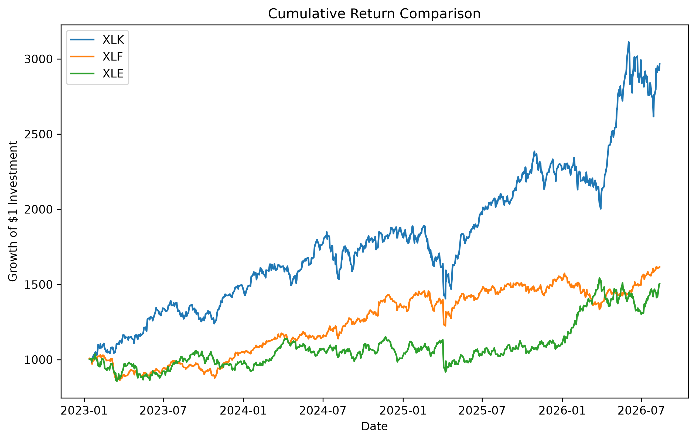
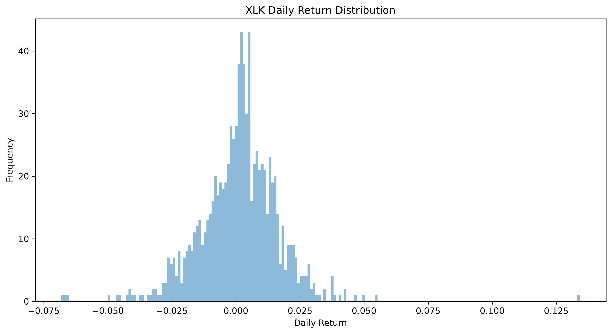
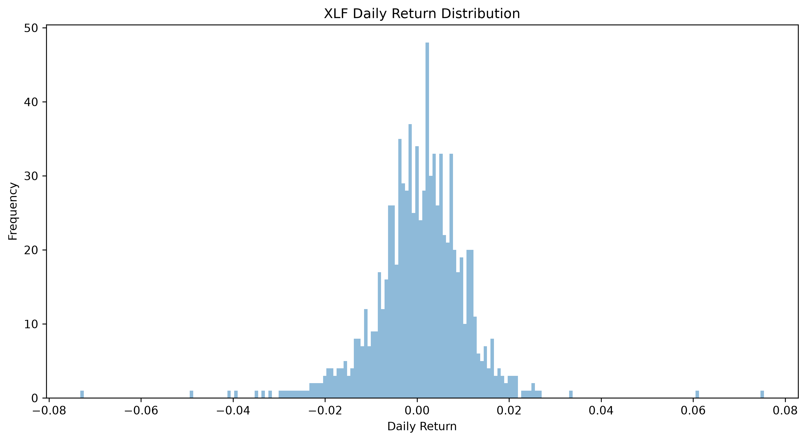
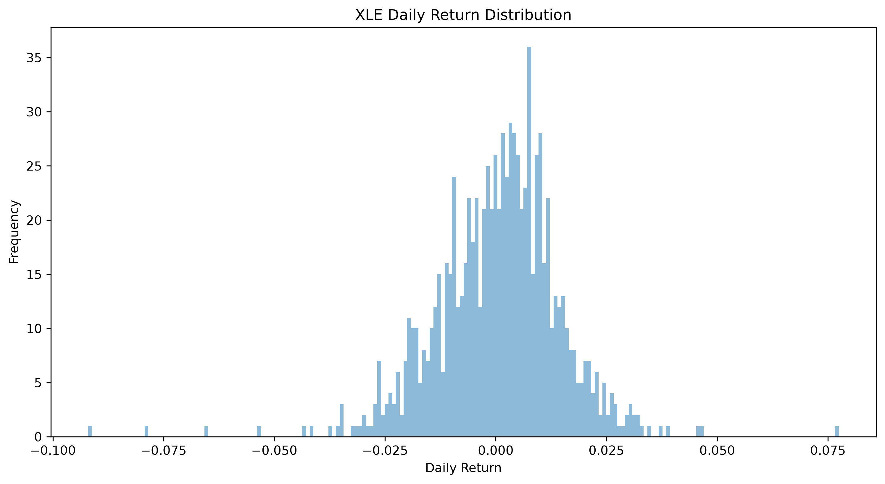

# Cross-Sector ETF Risk Analysis Report

## 1. Return Performance Analysis

### 1.1 Overview

This section evaluates the historical return performance of three sector ETFs:

- **XLK (Technology Sector)**
- **XLF (Financial Sector)**
- **XLE (Energy Sector)**

The analysis focuses on cumulative investment growth and daily return characteristics based on historical price data.

A hypothetical initial investment of **$1,000** is used to compare the wealth accumulation performance of each ETF over the sample period.

---

## 1.2 Investment Growth Analysis

*Figure 1. Growth of a hypothetical $1,000 investment across XLK, XLF, and XLE.*

The cumulative return comparison illustrates the growth of a hypothetical $1,000 investment across the three sector ETFs.

XLK achieved the strongest investment growth during the sample period, increasing from approximately **$1,000 to around $3,000**. XLF and XLE also generated positive returns, reaching approximately **$1,600** and **$1,500**, respectively.

Overall, the chart demonstrates significant differences in long-term wealth accumulation among different sectors. Technology stocks generated stronger capital appreciation, while financial and energy sectors delivered more moderate but positive growth.

---

## 1.3 Investment Performance Summary

The following table summarizes the investment outcomes and volatility characteristics of the three ETFs.

| ETF | Initial Investment | Final Value | Total Return | Annual Volatility |
| --- | --- | --- | --- | --- |
| XLK | $1,000 | $3,000 | +200% | 24.26% |
| XLF | $1,000 | $1,600 | +60% | 16.36% |
| XLE | $1,000 | $1,500 | +50% | 22.27% |

XLK generated the highest cumulative return among the three ETFs, reflecting strong long-term growth performance from the technology sector.

However, higher return was accompanied by higher volatility. Annualized volatility indicates differences in return fluctuations, with XLK and XLE experiencing larger price movements compared with XLF.

---

## 1.4 Daily Return Distribution Analysis

### 1.4.1 XLK Daily Return Distribution

*Figure 2. Daily return distribution of XLK.*

XLK displayed a relatively wide daily return distribution, indicating greater variation in daily performance.

This reflects the characteristics of technology companies, where valuations are often influenced by future growth expectations, interest rate assumptions, and investor risk appetite.

---

### 1.4.2 XLF Daily Return Distribution

*Figure 3. Daily return distribution of XLF.*

XLF showed a more concentrated return distribution, suggesting relatively stable daily return behavior during the sample period.

Compared with technology and energy sectors, financial companies generally exhibit lower valuation sensitivity to long-term growth expectations, resulting in relatively moderate price fluctuations.

---

### 1.4.3 XLE Daily Return Distribution

*Figure 4. Daily return distribution of XLE.*

XLE exhibited a wider distribution of daily returns, reflecting larger fluctuations compared with more stable sectors.

The higher volatility is mainly associated with energy companies' exposure to commodity price movements, supply-demand changes, and geopolitical uncertainty.

---

# 2. Sector Volatility Drivers Analysis

## 2.1 Overview

The cumulative return comparison and daily return distribution analysis demonstrate significant differences in performance and volatility characteristics among XLK, XLF, and XLE.

Although all three sector ETFs generated positive returns during the sample period, their return patterns were influenced by different economic exposures and market drivers.

This section analyzes the fundamental factors behind each sector's volatility by examining:

- Sector business exposure
- Key market drivers
- Volatility transmission mechanisms
- Relationship with observed return performance

---

# 2.2 XLK - Technology Sector

## Main Exposure

XLK primarily provides exposure to technology-related industries, including:

- Semiconductor companies
- Software companies
- Hardware manufacturers
- Technology service providers

Technology companies are generally characterized by strong growth potential and higher valuation multiples compared with traditional sectors.

---

## Sector Background

Compared with traditional industries, technology companies' **valuation** relies more heavily on **future earnings growth expectations**.

Since a significant portion of technology companies' value comes from expected future cash flows, their stock prices are more sensitive to changes in:

- Interest rate expectations
- Long-term growth assumptions
- Investor risk appetite

Therefore, technology stocks usually demonstrate higher valuation sensitivity and greater volatility.

---

## Volatility Transmission Mechanisms

### 1. Interest Rate Transmission

Technology companies are often valued based on their expected future cash flows. Therefore, changes in interest rate expectations can significantly influence their valuation multiples.

When interest rate expectations rise, investors apply a higher discount rate to future earnings, reducing the present value of expected cash flows.

As a result, high-growth technology companies may experience larger valuation adjustments compared with companies with more stable current earnings.

---

### 2. Growth Expectation Transmission

The valuation of major technology companies is highly dependent on investors' expectations regarding future business growth.

Important earnings assumptions include:

- Revenue growth forecast
- Margin expansion expectation
- EPS forecast
- Free Cash Flow (FCF) expectation

Because technology companies usually trade at higher valuation multiples, changes in growth expectations can lead to significant price movements.

For example, a company experiencing slower-than-expected revenue growth may face a sharp valuation adjustment even if current earnings remain strong.

---

### 3. Market Sentiment Transmission: Risk-on and Risk-off Environment

During a **risk-on environment**, investors tend to have higher confidence in future economic growth and are more willing to allocate capital toward higher-growth assets.

As market uncertainty decreases, investors are more likely to accept higher valuation multiples for technology companies due to stronger expectations for future revenue growth, margin expansion, and innovation-driven earnings potential.

This increased demand for technology stocks can lead to valuation expansion and stronger performance for XLK.

In contrast, during a **risk-off environment**, investors usually reduce exposure to high-valuation and growth-oriented assets due to concerns about economic slowdown, higher interest rates, or uncertainty in future earnings.

Since technology companies are often priced based on long-term growth expectations, negative changes in market sentiment can result in faster valuation repricing compared with more defensive sectors.

Therefore, technology sectors tend to experience stronger upside momentum during favorable market conditions but larger corrections during periods of uncertainty.
---

# 2.3 XLF - Financial Sector

## Main Exposure

XLF primarily provides exposure to financial institutions, including:

- Commercial banks
- Insurance companies
- Capital market companies
- Financial service providers

Compared with technology companies, financial companies generate earnings mainly through lending activities, capital allocation, and financial services.

Therefore, their performance is closely connected with:

- Interest rate conditions
- Credit cycles
- Economic activity
- Capital market conditions

---

## Sector Background

Unlike technology companies, whose valuations are mainly driven by future growth expectations, financial companies are more dependent on current economic conditions and operating environments.

The profitability of financial institutions is highly influenced by:

- Interest rate environment
- Net Interest Margin (NIM)
- Credit quality
- Loan demand
- Economic growth expectations

Therefore, XLF generally exhibits a more cyclical return pattern and is sensitive to changes in macroeconomic conditions rather than long-term growth expectations.

---

## Volatility Transmission Mechanisms

### 1. Interest Rate Transmission

Interest rates are one of the most important factors affecting financial sector performance because they directly influence banks' lending profitability.

A moderate increase in interest rates can benefit banks by increasing lending yields and expanding **Net Interest Margin (NIM)**, which improves profitability expectations.

However, if interest rates remain high for an extended period, borrowing costs may increase, loan demand may weaken, and credit risks may rise.

Therefore, the impact of interest rates on XLF depends on the broader economic environment rather than simply the direction of rate movements.

---

### 2. Credit Cycle Transmission

Financial institutions are highly exposed to credit conditions because a significant portion of their earnings comes from lending activities.

During periods of strong economic growth, businesses and consumers generally maintain healthier financial conditions, supporting loan growth and reducing default risks.

However, when economic conditions deteriorate, rising unemployment, weaker corporate profitability, or declining consumer confidence can increase default risk.

Banks may need to increase loan loss provisions, which reduces profitability expectations and creates pressure on financial sector valuations.

---

### 3. Market Sentiment Transmission: Risk-on and Risk-off Environment

Although financial stocks are generally less sensitive to growth expectations compared with technology stocks, investor sentiment still plays an important role in determining capital flows into the financial sector.

During a **risk-on environment**, investors usually expect stronger economic activity, higher corporate investment, and improved financial conditions.

This increases expectations for:

- Loan growth
- Capital market activity
- Corporate financing demand
- Overall profitability of financial institutions

As a result, investors may increase exposure to financial stocks, supporting XLF performance.

In contrast, during a **risk-off environment**, investors become more concerned about economic slowdown, liquidity conditions, and potential financial instability.

Since banks are closely connected with the broader economy, negative sentiment can quickly translate into concerns about:

- Credit quality deterioration
- Higher default rates
- Lower profitability expectations

Therefore, financial stocks usually experience pressure during periods of economic uncertainty, although their downside movements are often less driven by valuation compression compared with technology stocks.

---

# 2.4 XLE - Energy Sector

## Main Exposure

XLE primarily provides exposure to energy-related industries, including:

- Oil and gas exploration companies
- Integrated energy companies
- Energy production and service providers

Unlike technology and financial sectors, energy companies are highly dependent on commodity markets, especially crude oil prices.

Therefore, XLE performance is strongly influenced by:

- Global energy supply
- Demand conditions
- Commodity price movements
- Geopolitical factors

---

## Sector Background

Compared with technology and financial companies, energy companies have a more cyclical business model because their profitability is closely linked to commodity price movements.

The earnings of energy companies are mainly influenced by:

- Crude oil and natural gas prices
- Global supply and demand conditions
- Production decisions from major energy producers
- Geopolitical events

Therefore, XLE usually demonstrates stronger cyclical characteristics and higher sensitivity to external market shocks.

---

## Volatility Transmission Mechanisms

### 1. Oil Price Transmission

Crude oil price is one of the most important drivers of energy sector performance because it directly affects the revenue and profitability of energy companies.

When oil prices increase, energy companies can generate higher revenue and stronger cash flow, improving investor expectations regarding future earnings.

As a result, capital tends to flow into the energy sector, supporting XLE performance.

However, when oil prices decline, investors may reassess the profitability of energy companies, leading to:

- Downward earnings revisions
- Lower cash flow expectations
- Increased selling pressure

Because energy companies have direct exposure to commodity prices, changes in oil prices can quickly translate into significant movements in XLE.

---

### 2. Supply-Demand Cycle Transmission

Energy markets are highly influenced by global supply and demand conditions.

Unlike sectors driven mainly by company-specific innovation, energy prices are determined by the balance between global production and consumption.

When global economic activity strengthens, energy demand typically increases, supporting higher commodity prices and improving energy sector profitability.

In contrast, concerns about economic slowdown can reduce energy demand expectations and pressure energy prices.

Therefore, XLE performance is closely linked to global economic cycles and commodity market conditions.

---

### 3. Geopolitical Risk Transmission

Energy markets are particularly sensitive to geopolitical events because global oil supply can be affected by:

- Political conflicts
- Production disruptions
- Export restrictions
- Decisions from major energy-producing countries

When geopolitical uncertainty increases, investors may expect potential supply disruptions, which can push oil prices higher.

This can temporarily benefit energy companies through stronger commodity prices.

However, geopolitical uncertainty can also increase market uncertainty and create larger price fluctuations, resulting in higher volatility in the energy sector.

---

### 4. Market Sentiment Transmission: Risk-on and Risk-off Environment

Compared with technology stocks, energy companies are not primarily viewed as long-term growth assets.

Instead, investor sentiment toward XLE is often connected with expectations regarding:

- Economic activity
- Inflation trends
- Commodity prices
- Global industrial demand

During a **risk-on environment**, investors usually expect stronger economic growth and higher energy demand.

This can improve expectations for commodity prices and increase capital allocation toward cyclical sectors such as energy.

During a **risk-off environment**, investors often become concerned about economic slowdown and weaker commodity demand.

This can reduce expectations for energy prices and increase downside pressure on energy stocks.

Therefore, XLE tends to perform strongly during periods of economic expansion and commodity strength but may experience significant volatility during periods of macroeconomic uncertainty.

---

# 3. Conclusion

The return analysis shows that all three sector ETFs generated positive investment growth during the sample period.

XLK achieved the strongest cumulative performance, reflecting the strong long-term growth potential of the technology sector. However, this higher return was accompanied by greater volatility due to sensitivity to interest rates, growth expectations, and investor sentiment.

XLF demonstrated a more stable return profile, reflecting the characteristics of financial companies whose performance depends primarily on interest rate conditions, credit cycles, and economic activity.

XLE generated positive but more volatile returns due to its direct exposure to commodity prices, supply-demand cycles, and geopolitical risks.

Overall, the analysis highlights that different sectors respond differently to macroeconomic environments:

- **Technology sectors are more sensitive to valuation expectations and market risk appetite.**
- **Financial sectors are more influenced by interest rates and economic cycles.**
- **Energy sectors are more exposed to commodity markets and geopolitical uncertainty.**

These differences provide the foundation for further risk analysis using:

- Sharpe Ratio
- Value at Risk (VaR)
- Conditional Value at Risk (CVaR)
- Maximum Drawdown